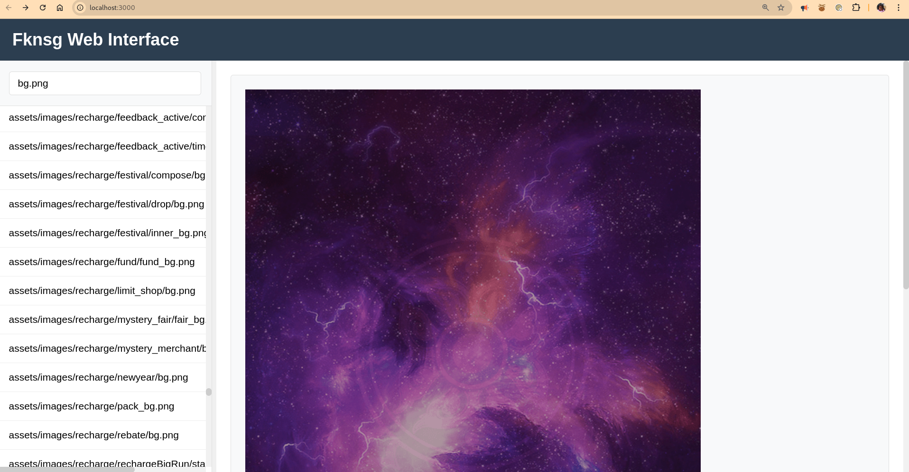

# Test APK

I am using a popular game using Cocos2d-X for testing.    
[Download link](https://apkpure.com/fang-kai-na-san-guo-song-diao-chan/com.sincetimes.fknsg/downloading/7.0.0) 
Game name: 放开那三国    
Package name : com.sincetimes.fknsg  

# How to use
## a. Install downloaded apk file to your Android device, and start frida server on your Android device.[How to setup your Android device with frida server](https://frida.re/docs/android/) . And besure your android device have a good Intenet connection, or the app will not start.
## b. Set up your NDK environment
```bash
    export NDKPATH=<your ndk path for android-ndk-r15c>
```
## c. Connet your android device to you computer, and compile frida agent code
```bash
    cd frida
    make  # this command will compile frida agent code, and push .so to your android device
```
## d. Install required node modules
```bash
    cd web
    npm i
```
## e. Start web server
```bash
    cd web
    npm run dev
```  
Now you can see the web interface in your browser. Visit http://localhost:3000

## Screenshots
- 
- 

## trouble shooting
1. If you see error message like this:
```bash
    error while loading shared libraries: libncurses.so.5 : cannot open shared object file: No such file or directory 
```

This is because your machine has no `libncurses.so.5` file, you can install it by `apt install ncurses-dev` in termux, or `apt install libncurses5` in ubuntu.
Or just link `libncurses.so.5` to `libncurses.so`
 just link `libtinfo.so.5` to `libtinfo.so`
You can find these files in your linux system at `/usr/lib/x86_64-linux-gnu`


